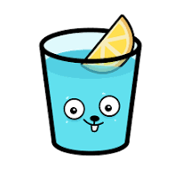

<h1> 💫 About Me (Dev Star)  </h1>

<h3>
  - 🔭 Software Engineer with 6+ years of experience in various areas from backend to frontend 
  - 📦 AI enthusiast with 4+ years of experience. mastered ML, DL, RL(special) 
  - 📤 Scraping and Automation specialist with solid experience leveraging several tools and APIs 
  - 🚀 Blockchain developer with 3+ years of experience in layer1 and layer2 blockchain. 
  - 👍 Experienced in DevOps, CI/CD, and Cloud infrastructure, especially with AWS, DigitalOcean, GCP and Azure 
</h3>

  

<h1> My Skill Sets  </h1>

---

### Languages

  

---

### Libraries

  

---

### Frameworks 

<!--  -->
  
 

---

### Database

</a>

  

---

### Tools

<a href="https://www.jenkins.io/" target="_blank"> </a>
  

---

  <h1> 
    My GitHub Stats 
    
  </h1>

<table align="center">
  <tr>
    
  </tr>
  <tr>
    <td align="center" width="50%">
        
    </td>
    <td align="center" width="50%">
        
    </td>
  </tr>
  <tr>
    <td align="center" width="40%">
        
    </td>
    <td align="center" width="60%">
        
    </td>
  </tr>
</table>

<h2>
  If you found this project useful or interesting, please consider giving it a 
  <a href="https://github.com/dev-star712/dev-star712/#">
     Star
  </a>.
  If you'd like to use this template, feel free to 
  <a href="https://github.com/dev-star712/dev-star712/fork">
    Fork
  </a> 
  it and customize it to your needs!
</h2> 

